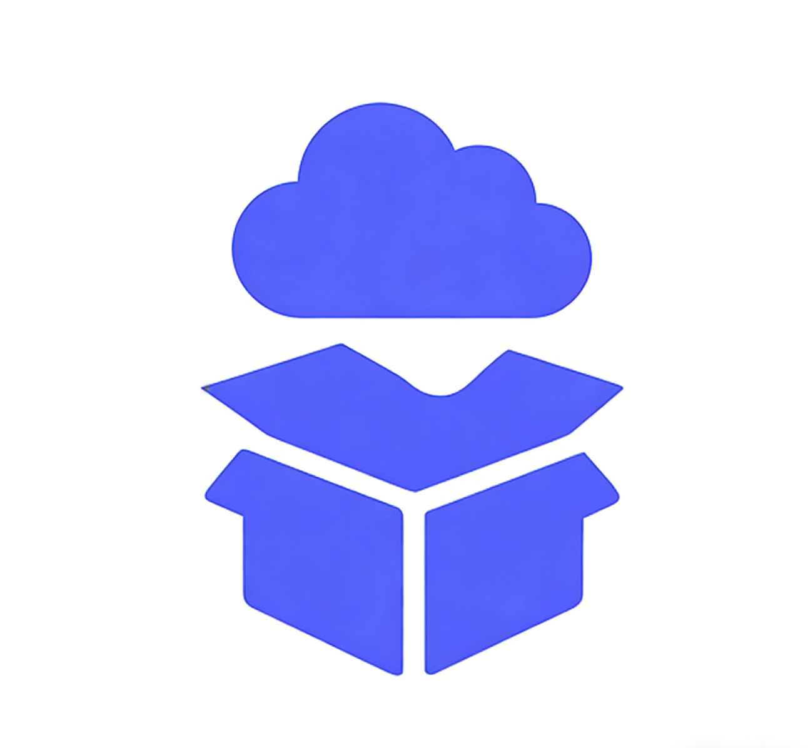

## License

This project is licensed under a **Personal-Use Only License**.

- 个人免费、可修改、可分发
- 商业使用需获得作者授权

查看完整协议请见：**[LICENSE](./LICENSE)**。

## CloudDock
<p align="center">

</p>
CloudDock（云仓）是开源的内网穿透工具，采用 WebSocket 隧道技术，让你可以通过公网轻松访问家庭网络中的设备和服务。彻底告别繁琐的内网穿透配置和付费的代理软件！

### 组件

CloudDock 包含三个核心服务组件，部署简单灵活。

#### Server 服务端（可选）

没有服务器的小伙伴可以用的我的服务！

部署在有公网 IP 的服务器上，负责：

- 用户认证和会话管理
- 设备注册和心跳保活
- WebSocket 隧道建立和数据转发

#### NAS Client 客户端

部署在家庭 NAS 或内网设备上，负责：

- 与服务端保持 WebSocket 长连接
- 转发内网服务到公网
- 提供本地 Web UI 管理界面
- 支持服务发现和自动重连

#### 移动端

- 服务端管理后台
- 设备在线状态监控
- 隧道配置和管理
- 实时日志查看


### CloudDock 优点

- 安全：内网穿透需要将设备暴露在公网，一旦被攻陷，所有内网设备都在裸奔
- 快捷：穿透的代理和内网穿透配置十分复杂，而且不一定能配置成功
- 可控：支持私有部署，数据完全在自己服务器上

### 快速部署

#### NAS Client 部署

```yaml
version: '3.9'

services:
  edge:
    image: mmdctjj/clouddock-edge:latest
    ports:
      - '3000:3000'  # Web UI
      - '5700:5700'  # Local API
    environment:
      # 根据情况修改成自己的域名
      - WEB_API_URL=https://cloud.audiodock.cn/api
      - WEB_WS_URL=wss://cloud.audiodock.cn/ws/device
      - WEB_PUBLIC_BASE_URL=https://cloud.audiodock.cn
    restart: unless-stopped
```

#### 服务端部署（可选）

> 如果你没有服务器，也可以使用我的在线服务，只需要在 nas-client 指定我的服务地址就行！

```yaml
version: '3.9'

services:
  server:
    image: mmdctjj/clouddock-server:latest
    user: "0:0"
    ports:
      - '3300:3000'
      - '3301:3001'
    environment:
      DATABASE_URL: file:/data/dev.db
      REDIS_URL: redis://redis:6379
      NODE_ENV: production
      PORT: 3000
      WS_PORT: 3001
      JWT_SECRET: 6794dd71a54449b27c3540725ea677d6
      CORS_ORIGIN: "*"
    volumes:
      - server_data:/data

volumes:
  server_data:
````

### 使用说明


#### NAS 客户端连接

1. 在 NAS 客户端管理界面（[http://nas-ip:3000）](http://nas-ip:3000）)
2. 注册用户并登录，注意需要指定唯一的用户名称作为标识路径


2. 创建隧道，指定服务名称、地址和端口点击创建


3. 创建成功后复制访问路径


4. 在对应服务客户端输入地址用户名和密码，点击登录，下面是 AudioDock 为例


如果访问设备在其他机器上，不出意外第一次会失败，因为这时候请求设备还没有被批准，需要回到管理页面通过请求


允许后，再次点击登录就成功了！

4. 连接成功后，可以在管理后台看到设备在线


### 客户端下载

https://github.com/NasDock/CloudDock/releases


## ⭐ Star History

[](https://star-history.com/#NasDock/CloudDock&Date)
